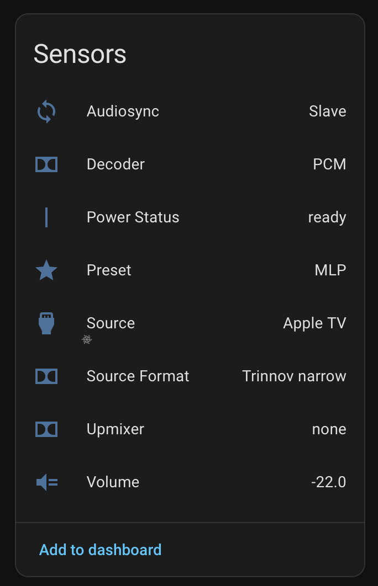
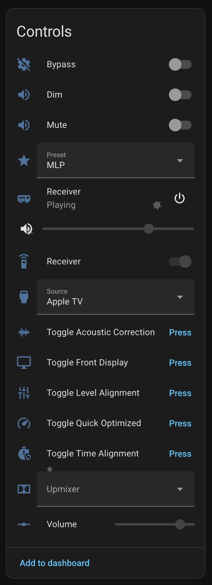
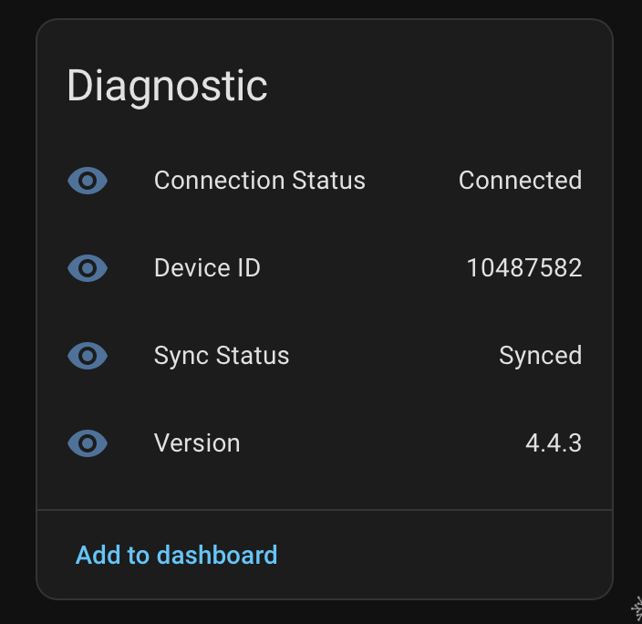

# Trinnov Altitude Home Assistant Integration

A [Home Assistant](https://www.home-assistant.io) integration for the
[Trinnov Altitude](https://www.trinnov.com/en/products/altitude32/) processor. Uses the [`trinnov-altitude`](https://github.com/binarylogic/py-trinnov-altitude) library.

## Project Status

This repository is the canonical and maintained Trinnov Altitude integration for Home Assistant.

This project is intentionally maintained as a high-quality custom integration instead of targeting Home Assistant Core. That allows faster iteration, tighter protocol coverage, and stronger device-specific UX without Core release constraints.

Release notes and compatibility updates are tracked in this repository.

## Prerequisites

1. Home Assistant 2024.4.1 or newer
2. [HACS](https://hacs.xyz) installed
3. Trinnov Altitude accessible on your network

**It's strongly recommended to assign your Trinnov Altitude a static IP address.**

## Installation

### Via HACS (Recommended)

1. Open HACS in Home Assistant.
2. Go to `Integrations`.
3. Search for `Trinnov Altitude`.
4. Open it and click `Download`.
5. Restart Home Assistant.
6. Go to Settings > Devices & Services > `Add Integration`.
7. Search for `Trinnov Altitude` and complete setup.

If HACS has not synced the default index update yet, temporarily add it as a custom repository:

1. In HACS, open the top-right menu (three dots) and choose `Custom repositories`.
2. Add `https://github.com/binarylogic/trinnov-altitude-homeassistant` as category `Integration`.
3. Refresh HACS and install as above.

### Manual

1. Download the latest release
2. Copy `custom_components/trinnov_altitude` to your `config/custom_components` directory
3. Restart Home Assistant

## Configuration

1. Go to Settings > Devices & Services
2. Click "+ Add Integration"
3. Search for "Trinnov Altitude"
4. Enter your device's IP address
5. Optionally enter the MAC address (required for Wake-on-LAN power on)

## Quick Start (5 Minutes)

If you just want to get working fast:

1. Add the integration with your Trinnov IP.
2. Also add the Trinnov MAC address during setup (recommended, enables power on from Home Assistant).
3. Open your Trinnov device in Home Assistant and add these entities to a dashboard:
   - `media_player.trinnov_altitude_*`
   - `remote.trinnov_altitude_*`
   - `number.*_volume`
   - `select.*_source`
   - `select.*_preset`
4. Verify diagnostics:
   - `sensor.*_power_status` should become `ready`
   - `sensor.*_connection_status` should become `connected`
   - `sensor.*_sync_status` should become `synced`

## How You Actually Use It

Common day-to-day patterns in Home Assistant:

1. Use `media_player` for source, volume, mute, and power in one card.
2. Use `select.*_source` and `select.*_preset` in automations for deterministic setup.
3. Use `remote.send_command` for advanced commands like upmixer/remapping changes.
4. Gate automations on readiness:
   - `remote.*` state `on` means connected and synced.
   - Wait for this before sending follow-up commands after power-on.

Example: safe startup sequence

```yaml
automation:
  - alias: "Watch Movie"
    trigger:
      - platform: state
        entity_id: input_boolean.watch_movie
        to: "on"
    action:
      - service: remote.turn_on
        target:
          entity_id: remote.trinnov_altitude_*
      - wait_for_trigger:
          - platform: state
            entity_id: remote.trinnov_altitude_*
            to: "on"
        timeout: "00:00:30"
      - service: remote.send_command
        target:
          entity_id: remote.trinnov_altitude_*
        data:
          command:
            - source_set_by_name Kaleidescape
            - preset_set 1
            - volume_set -40.0

```

## Wake-on-LAN (Recommended)

Wake-on-LAN lets Home Assistant power on the Trinnov when it is off.

Requirements:

1. Enter a valid MAC address in integration setup.
2. Keep the Trinnov on a network path where Home Assistant can deliver WoL packets.
3. Use `remote.turn_on` or `media_player.turn_on` to send power-on.

Important behavior:

1. If MAC is missing, power-on will fail.
2. Right after power-on, the device may be reachable but not fully synced yet.
3. Always wait for `remote.trinnov_altitude_*` to become `on` before sending additional commands.

## Troubleshooting

If it does not behave as expected:

1. Setup says "Failed to connect":
   - Confirm Trinnov is powered and reachable by IP from Home Assistant host.
2. Setup says "MAC address is invalid":
   - Re-enter MAC in standard form (for example `00:11:22:33:44:55`).
3. `remote.send_command` fails when off:
   - Power on first (`remote.turn_on`) and wait for `remote.*` state `on`.
4. Commands run but state looks stale:
   - Check `sensor.*_connection_status` and `sensor.*_sync_status` first.
5. Source/preset names look generic (`Source 3`, `Preset 2`):
   - This is a protocol fallback when labels are missing/late.
   - Control still works by index; friendly names appear once the Trinnov sends label/profile-name catalog messages.

## Entities

### Switches

Control toggleable features with state feedback:

| Entity | Description |
|--------|-------------|
| `switch.*_mute` | Mute audio |
| `switch.*_dim` | Dim volume |
| `switch.*_bypass` | Bypass Trinnov optimizer |

### Selects

Dropdown selectors for device settings:

| Entity | Description |
|--------|-------------|
| `select.*_source` | Input source |
| `select.*_preset` | Audio preset |
| `select.*_upmixer` | Upmixer mode (native, dolby, dts, auro3d, etc.) |

### Number

| Entity | Description |
|--------|-------------|
| `number.*_volume` | Volume slider (-120 dB to 0 dB, 0.5 dB steps) |

### Buttons

Toggle buttons for features without state feedback:

| Entity | Description |
|--------|-------------|
| `button.*_toggle_acoustic_correction` | Toggle acoustic correction |
| `button.*_toggle_front_display` | Toggle front display |
| `button.*_toggle_level_alignment` | Toggle level alignment |
| `button.*_toggle_optimization` | Toggle optimization |
| `button.*_toggle_time_alignment` | Toggle time alignment |

### Sensors

Read-only state information:

| Entity | Description |
|--------|-------------|
| `sensor.*_volume` | Current volume (dB) |
| `sensor.*_source` | Current source name |
| `sensor.*_preset` | Current preset name |
| `sensor.*_decoder` | Active decoder |
| `sensor.*_upmixer` | Active upmixer |
| `sensor.*_source_format` | Source audio format |
| `sensor.*_audiosync` | Audiosync mode (Master/Slave) |

### Media Player

Full media player entity with volume, mute, source selection, and power control.

### Remote

Send commands via the `remote.send_command` service:

```yaml
service: remote.send_command
target:
  entity_id: remote.trinnov_altitude_*
data:
  command:
    - mute_on
```

#### Available Commands

**Toggle Commands:**
- `acoustic_correction_on/off/toggle`
- `bypass_on/off/toggle`
- `dim_on/off/toggle`
- `front_display_on/off/toggle`
- `level_alignment_on/off/toggle`
- `mute_on/off/toggle`
- `optimization_on/off/toggle`
- `time_alignment_on/off/toggle`

**Navigation:**
- `page_up`, `page_down`
- `volume_up`, `volume_down`

**Commands with Parameters:**
- `preset_set <int>` - Set preset by index
- `source_set <int>` - Set source by index
- `source_set_by_name <string>` - Set source by name
- `volume_set <decimal>` - Set volume in dB
- `volume_percentage_set <decimal>` - Set volume as 0-100%
- `volume_ramp <decimal>` - Ramp volume to target
- `upmixer_set <string>` - Set upmixer (native, dolby, dts, auro3d, etc.)
- `remapping_mode_set <string>` - Set remapping mode (none, 2D, 3D, etc.)

## Example Automations

### Send Commands (Device Already On)

```yaml
service: remote.send_command
target:
  entity_id: remote.trinnov_altitude_*
data:
  command:
    - source_set_by_name Kaleidescape
    - volume_set -40.0
```

### Power On and Configure

The remote entity's state reflects readiness - `on` when connected and synced, `off` when disconnected or still syncing. Use this to wait for the device to be ready after Wake-on-LAN:

```yaml
automation:
  - alias: "Theater Mode"
    trigger:
      - platform: state
        entity_id: remote.kaleidescape
        to: "on"
    action:
      - service: remote.turn_on
        target:
          entity_id: remote.trinnov_altitude_*
      - wait_for_trigger:
          - platform: state
            entity_id: remote.trinnov_altitude_*
            to: "on"
        timeout: "00:00:30"
      - service: remote.send_command
        target:
          entity_id: remote.trinnov_altitude_*
        data:
          command:
            - source_set_by_name Kaleidescape
            - volume_set -40.0
```

## Development

```bash
# Install uv (if needed)
curl -LsSf https://astral.sh/uv/install.sh | sh

# Setup
make install

# Or directly with uv
uv sync --group dev

# Development
make test        # Run tests
make test-fast   # Run tests without coverage
make lint        # Check code
make format      # Format code

# Release
make release     # Run checks and create release zip
```

## Screenshots

### Sensors



### Controls



### Diagnostics



## Support

Issues and feature requests: [GitHub Issues](https://github.com/binarylogic/trinnov-altitude-homeassistant/issues)
